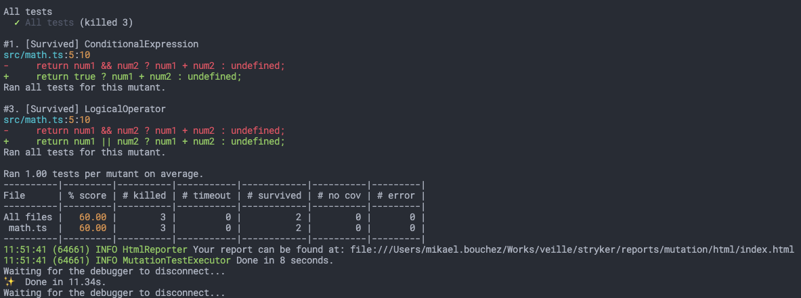

# Stryker demo

Stryker command mutate code to tests exhaustivity of your tests

```
yarn run mutation
```

### Step 1

From the very first step commit `a57eb3a` you should see this report



That means your tests suite is not complete because one of mutation has survived to 

- Conditional expression
- Logical operator

We understand that the test is not exhaustive. 

#### First step test suite

```javascript
describe("addition", () => {
  it("should addition num1 and num 2", () => {
    const result = addition(1, 2);
    expect(result).toBe(3);
  });
});
```

### Step 2

From the second step commit `5c16c9b` we just add a test to complete ours.

```javascript
describe("addition", () => {
  it("should addition num1 and num 2", () => {
    const result = addition(1, 2);
    expect(result).toBe(3);
  });
  it("should not add number if one parameters is missing", () => {
    const result = addition(1, undefined);
    expect(result).toBeUndefined();
  });
});
```

Then, the result should be 


